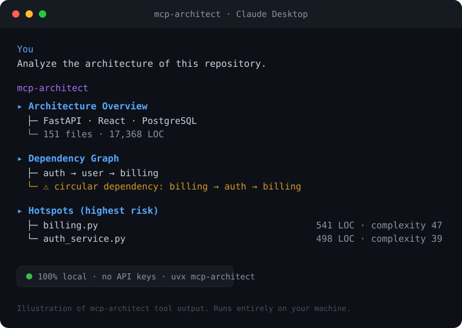

# 🏛️ mcp-architect

> **Stop pasting your file tree into Claude.** Give any AI assistant *real* architectural understanding of a codebase — **local, private, zero‑config.**

[](https://pypi.org/project/mcp-architect/)
[](LICENSE)
[](https://www.python.org/)
[](https://modelcontextprotocol.io/)

<p align="center">
  
</p>

AI coding assistants are great at *files* but blind to *architecture*. Every session you re‑explain the structure, paste the file tree, and hope it guesses your module boundaries right. **mcp-architect** is an [MCP](https://modelcontextprotocol.io/) server that hands your assistant a structured map of any codebase — tech stack, dependency graph, hotspots, and module summaries — computed **100% locally** with **no API keys and no model required**.

It works with **Claude Desktop, Cursor, Windsurf, Cline**, or any MCP client.

---

## Why

| Without mcp-architect | With mcp-architect |
|---|---|
| "Here's my file tree, please figure out the structure…" | `architecture_overview` → stack, entry points, structure in one call |
| AI guesses how modules relate | `dependency_graph` → real import graph + circular‑dependency detection |
| "Which files matter?" | `hotspots` → largest, most complex, most‑changed, highest‑risk |
| Re‑explaining a package every time | `explain` → classes, functions, and deps of any folder |

Everything runs on your machine. Your code never leaves it.

---

## Quickstart

### Install

```bash
pip install mcp-architect
```

…or skip the install entirely and let your MCP client fetch it on demand with `uvx` (shown below).

### 1. Add it to your MCP client

**Claude Desktop** — edit `claude_desktop_config.json`:

```json
{
  "mcpServers": {
    "architect": {
      "command": "uvx",
      "args": ["mcp-architect"]
    }
  }
}
```

> Prefer pip? `pip install mcp-architect`. Or run the latest straight from source:
> ```json
> { "mcpServers": { "architect": {
>     "command": "uvx",
>     "args": ["--from", "git+https://github.com/kannajune/mcp-architect", "mcp-architect"]
> } } }
> ```

Restart your client. **That's it** — no keys, no model download.

### 2. Ask your assistant

> *"Use the architect tools to give me an overview of `~/code/my-app`, then show me its dependency graph and the highest‑risk files."*

---

## What you get

```text
# Architecture Overview — my-app

**151 files · 17,368 lines of code**

## Languages
- **Python** — 93 files, 13,683 LOC
- **TypeScript** — 23 files, 3,120 LOC

## Frameworks / key libraries
- FastAPI
- React
- Tailwind CSS

## Entry points
- main.py
```

```text
# Dependency Graph — my-app

**118 modules · 172 internal import edges**

## Most depended-upon (architectural hubs)
- `app.signals.signal_parser` — imported by 12 modules
- `app.core.integrations_registry` — imported by 11 modules

## Circular dependencies
✅ no circular dependencies found
```

## Tools

| Tool | What it tells the AI |
|------|----------------------|
| `architecture_overview` | Languages, frameworks, ecosystems, size, top‑level structure, entry points |
| `dependency_graph` | Internal import graph, architectural hubs, **circular dependencies** |
| `impact_analysis` | **What breaks if you change X** — direct importers + transitive blast radius, hub risk |
| `hotspots` | Largest / most complex / most‑changed (git) / highest‑risk files |
| `explain` | Deep‑dive a folder or file: classes, functions, external deps |

---

## Design principles

- **Zero heavy dependencies.** Pure Python standard library for all analysis (`ast`, `os`, `re`). The only runtime dep is the MCP SDK itself. Installs in seconds.
- **Local & private.** No network calls, no telemetry, no LLM. Your source never leaves your machine.
- **Language‑aware.** Full AST parsing for Python; import parsing for JavaScript/TypeScript; file/LOC stats for 25+ languages.
- **Decoupled core.** The analysis layer (`mcp_architect.analysis`) is importable and testable on its own — use it as a plain Python library too.

```python
from mcp_architect.analysis import get_overview, get_dependency_graph
print(get_overview("~/code/my-app")["frameworks"])
```

> The dependency and complexity analysis is **heuristic** — designed to give an AI useful, fast situational awareness, not to replace a full static analyzer.

---

## Pin to one project (optional)

Set `MCP_ARCHITECT_ROOT` so tools default to a fixed repo and you can omit paths:

```json
{ "mcpServers": { "architect": {
    "command": "uvx", "args": ["mcp-architect"],
    "env": { "MCP_ARCHITECT_ROOT": "/Users/you/code/my-app" }
} } }
```

---

## How it compares

mcp-architect isn't a semantic search engine or a context packer — it's a
**structural lens** any AI assistant can call on demand. It's designed to
*complement* the tools below, not replace them:

| Tool / approach | Great at | What mcp-architect adds |
|---|---|---|
| **Cursor codebase indexing** | Semantic snippet retrieval, inside Cursor | Works in **any** MCP client (Claude Desktop, Cline, Windsurf, Cursor…), **100% local** (no cloud embeddings), and returns **architecture** — dependency graph, cycles, hotspots — not just relevant snippets |
| **Serena** (LSP-based code agent) | Precise symbol-level navigation & edits | **Zero-config, zero heavy deps** (stdlib — no language servers to install) and a **high-level architectural map** instead of symbol-by-symbol operations |
| **RepoPrompt** (context packing) | Hand-picking files into a prompt | The assistant **pulls** structured architecture on demand via tools — no manual file selection, no token-budget juggling |

**In one line:** Cursor and Serena help the AI *read* your code; mcp-architect
helps it *understand the architecture* — locally, in any client. They stack well
together.

## Roadmap

- [ ] Layered‑architecture / boundary‑violation detection
- [ ] Go, Rust & Java import graphs
- [ ] Optional local‑LLM (Ollama) narrative summaries
- [ ] `compare` tool for before/after architecture diffs

Contributions welcome — see [CONTRIBUTING](#contributing).

## Contributing

PRs and issues welcome! Run the tests with:

```bash
pip install -e ".[dev]"
pytest
```

## License

[MIT](LICENSE) © Kannan Dharmalingam
